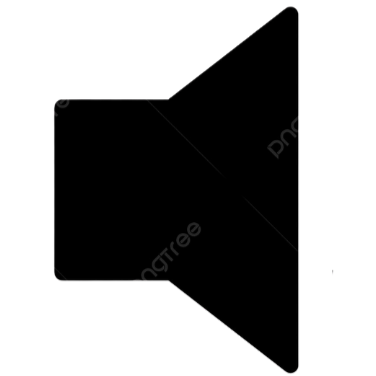
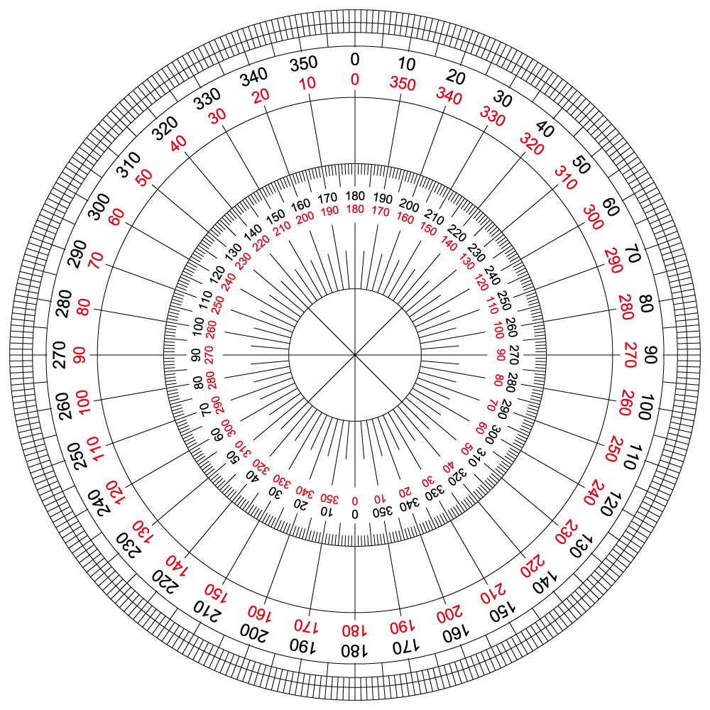

# simulacao_Lei_De_Malus
Simulação da Lei de Malus em Python utilizando Pygame

Crie uma pasta no seu editor de código com essas imagens, para que o pygame possa buscar e inserir as mesmas no projeto.

